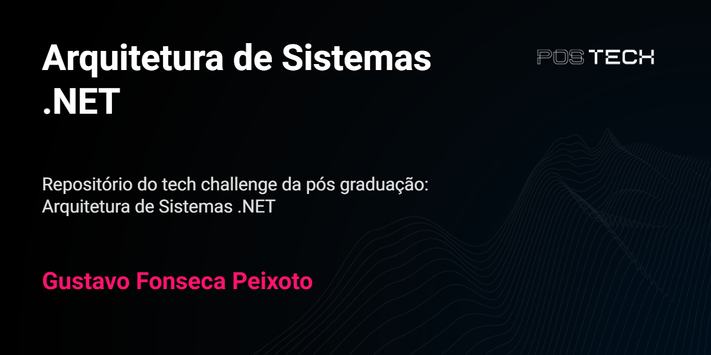
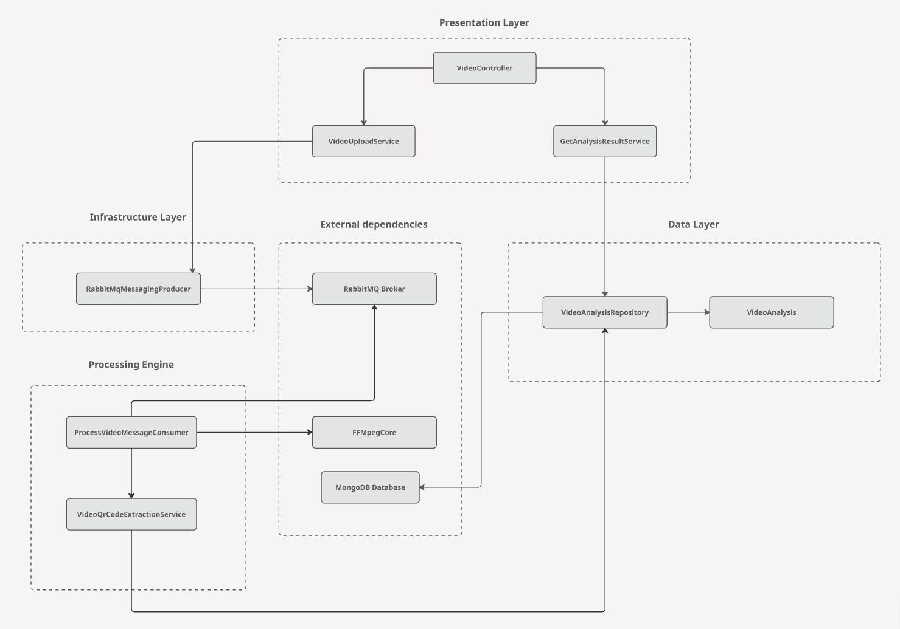
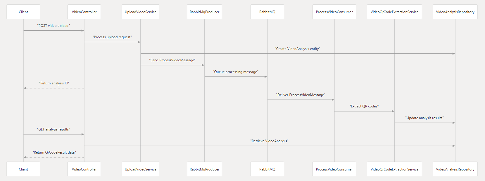
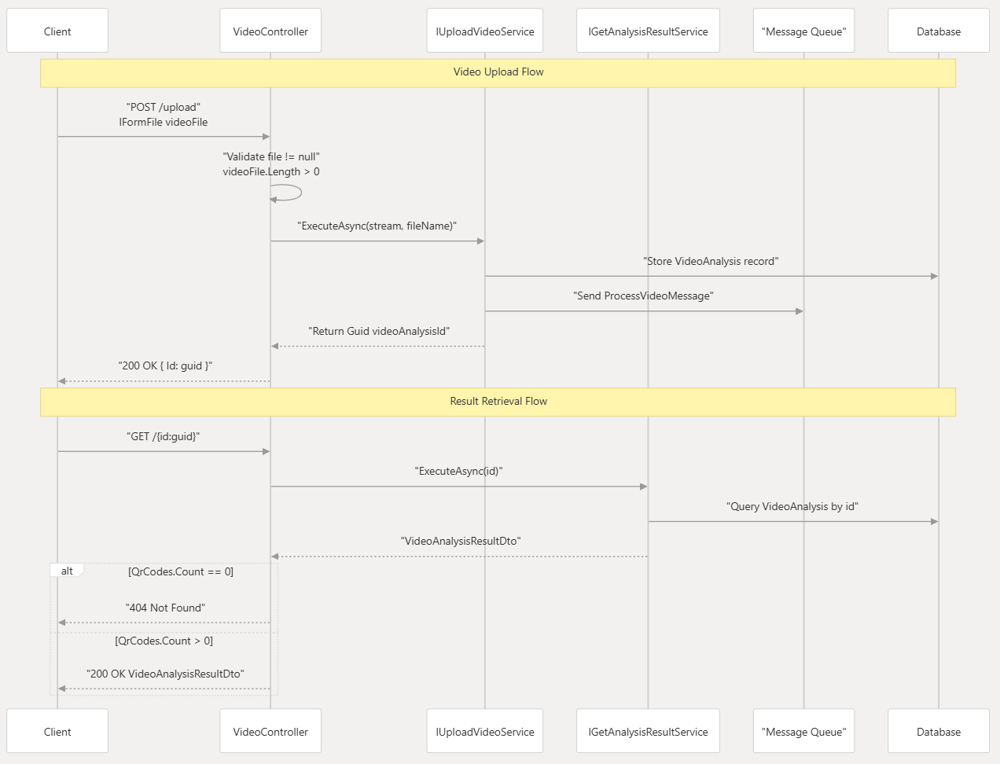

# Bem-vindo à Wiki do Projeto Visionary Analytics!

Este projeto contém o MVP de um microsserviço de alta performance para análise e extração de conteúdo de vídeos, desenvolvido para a startup **Visionary Analytics**.

### O Problema

> A Visionary Analytics, especializada em IA para análise de vídeo, enfrenta um gargalo operacional devido ao seu processo de análise semi-manual e lento. Isso impede o processamento de grandes volumes de vídeo e, consequentemente, o crescimento da empresa.

### Solução

Para resolver este desafio, foi projetado e desenvolvido um microsserviço focado em automatizar a análise primária dos vídeos. A solução utiliza uma arquitetura moderna, desacoplada e escalável para garantir performance e confiabilidade, servindo como o coração da futura plataforma de IA da empresa.

### Navegação

* [Visão Geral do Projeto](#visão-geral-do-projeto)
* [Arquitetura da Solução](#arquitetura-da-solução)
* [Tecnologias Utilizadas](#tecnologias-utilizadas)
* [Contato](#contato)

---

# Visão Geral do Projeto

### Contexto da Empresa: Visionary Analytics

A Visionary Analytics é uma startup de tecnologia especializada em inteligência artificial para análise de conteúdo de vídeo. Seus clientes, que vão desde agências de segurança a plataformas de e-learning, precisam processar grandes volumes de vídeo para identificar eventos específicos, objetos ou extrair informações relevantes de forma automatizada. Atualmente, o processo de análise é semi-manual e lento, criando um gargalo operacional que impede o crescimento da empresa.

Com o objetivo de inovar, a Visionary Analytics decidiu desenvolver um novo microsserviço de alta performance para decodificação e análise primária de vídeos. Este serviço será o coração da sua futura plataforma de IA.

# Arquitetura da Solução

A solução foi projetada seguindo os princípios de uma arquitetura de microsserviços, utilizando um padrão de comunicação assíncrona para garantir desacoplamento e resiliência.

### Componentes Principais

1.  **API (`QrVision.Api`)**: Ponto de entrada para os clientes. É responsável por receber as requisições de upload de vídeo, realizar validações iniciais e disparar o processo de análise.
2.  **Fila de Mensagens (Message Queue)**: Utilizamos o **RabbitMQ** como message broker. Após o upload, a API publica uma mensagem na fila contendo as informações necessárias para o processamento. Isso desacopla o ato do upload do processamento em si.
3.  **Worker de Processamento (`QrVision.Worker`)**: Um serviço de background que consome as mensagens da fila. É aqui que a "mágica" acontece: o worker baixa o vídeo, utiliza bibliotecas como **FFMpeg** para extrair frames e **ZXing.Net** para decodificar QR Codes.
4.  **Banco de Dados**: Uma base de dados `MongoDB` é usada para persistir o estado da análise e os resultados encontrados.

### Fluxo de Processamento

O fluxo de uma requisição ocorre da seguinte forma:

1.  O cliente envia um arquivo de vídeo via `POST` para o endpoint `/api/video/upload`.
2.  A **API** salva o vídeo em um armazenamento compartilhado (volume Docker).
3.  A **API** cria um registro na collection `VideoAnalysis` no banco de dados com o status "Em processamento" e retorna o `ID` da análise para o cliente.
4.  A **API** publica uma mensagem na fila `process-video` do RabbitMQ, contendo o `ID` da análise e o caminho do arquivo de vídeo.
5.  O **Worker** consome a mensagem da fila.
6.  O **Worker** executa o serviço de extração, processando o vídeo frame a frame para encontrar QR Codes.
7.  Ao final do processo, o **Worker** atualiza o registro no banco de dados com os resultados encontrados e muda o status para "Processamento completo".
8.  O cliente pode consultar o resultado a qualquer momento através do endpoint `GET /api/video/{id}`.

### Diagrama do Fluxo

### Camada da API

# Tecnologias Utilizadas

- **Linguagem e Framework**: C# com .NET 8
- **API**: ASP.NET Core Web API
- **Processamento de Vídeo**: FFMpegCore
- **Decodificação de QR Code**: ZXing.Net.ImageSharp
- **Mensageria**: RabbitMQ
- **Testes Unitários**: xUnit e Moq
- **Containerização**: Docker e Docker Compose

# Contato

Gustavo Peixoto
gustavo.fonseca.peixoto@gmail.com
